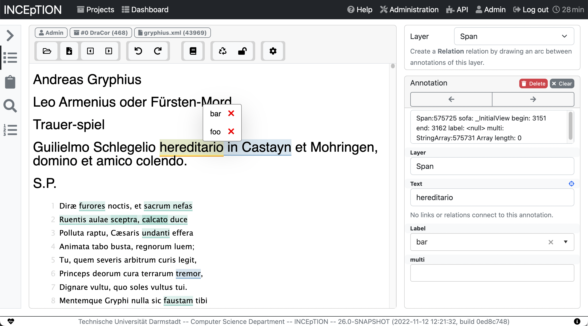

# INCEpTION Apache Annotator Editor Plugin

**Note: This is an early access repository. The way that things work will likely be subject to regular changes for the time being.** 



This repository is an example based on the [Apache Annotator](https://annotator.apache.org) JavaScript editor component of how to integrate a JavaScript-based annotation editor with INCEpTION. 

Starting with INCEpTION v23, external editor plugins are supported. To use this editor, first create a folder named `editors` in your INCEpTION application home. By default, this is `~/.inception`, but on server installations, you will usually have set it to something else such as `/srv/inception`.

Clone this repository as a sub-folder under the `editors` folder.

tl;dr: 

```
$ cd /srv/inception
$ mkdir editors
$ git clone https://github.com/inception-project/inception-apache-annotator-editor-plugin.git
```

Finally, start INCEpTION. Early during start-up, you should see a message like this:

```
ExternalEditorLoader - Loading editor plugin: Apache Annotator (external)
```

Also, on the annotation page, you should be able to switch to that editor.

## TEI support

This editor includes an experimental stylesheet for TEI files from the [DraCor](https://dracor.org)
project. Import them as `XML (generic)` into a project and try opening them with this editor.
